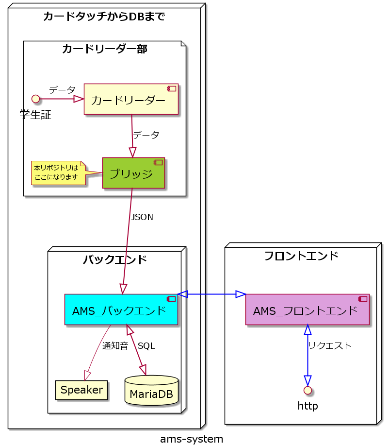

# rdr-bridge

## 仕様

- カードリーダーから学籍番号を読んでエンドポイントへ送る。

## 開発について

[詳細はこちら](CONTRIBUTING.md)

## 本リポジトリの図的イメージ

本リポジトリはこのような立ち位置になっています。

---

## 関係のあるリポジトリ一覧

## 議論したり、作業の優先順位を付けるリポジトリ

[ams-project](https://github.com/su-its/ams-project)

---

## バックエンド部

[AMS_バックエンド](https://github.com/su-its/ams-backend)

---

## フロントエンド部

[AMS_フロントエンド](https://github.com/su-its/ams-frontend)

---

## 独自機能(上記の表に記載はありません)

### レスポンスを受け取るリポジトリ

[bou_responder](https://github.com/su-its/bou-responder)
